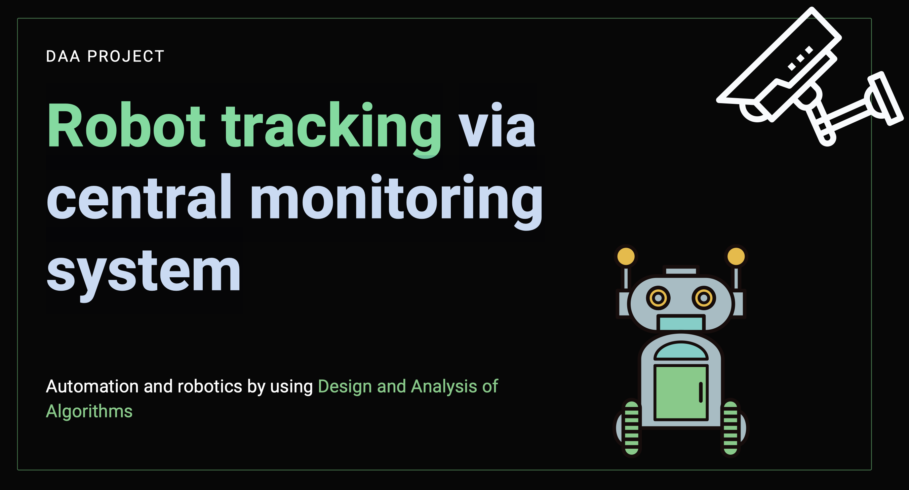
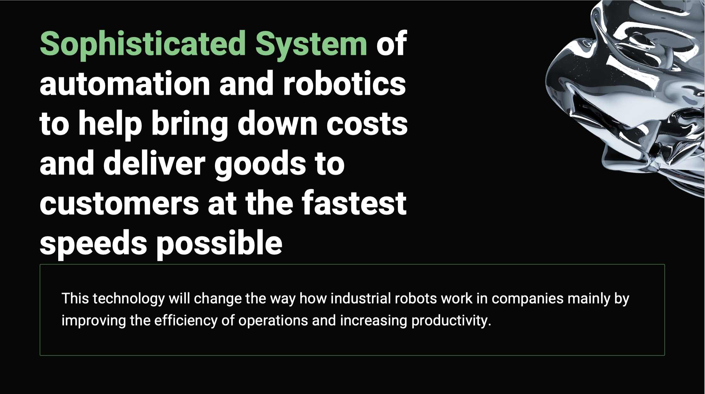
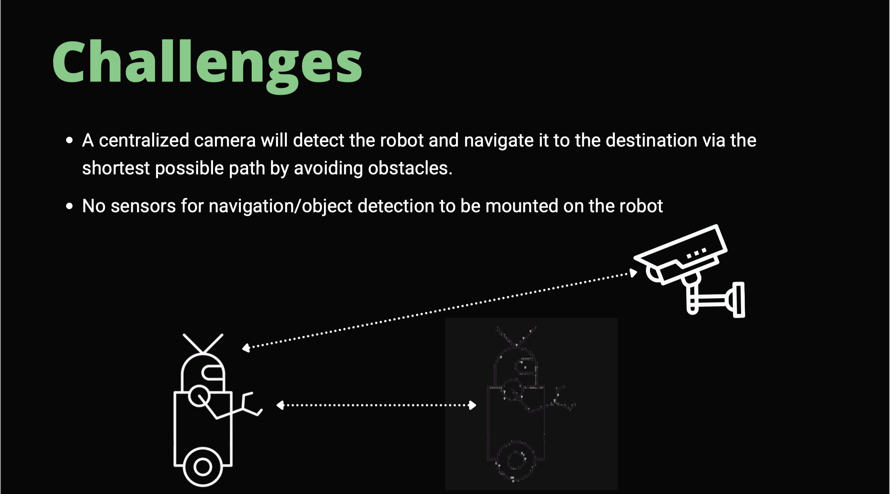
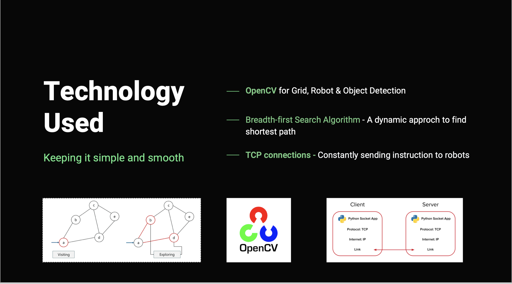
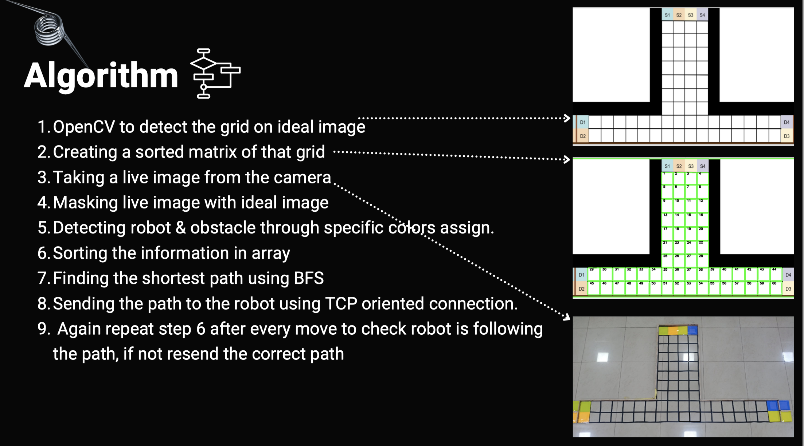
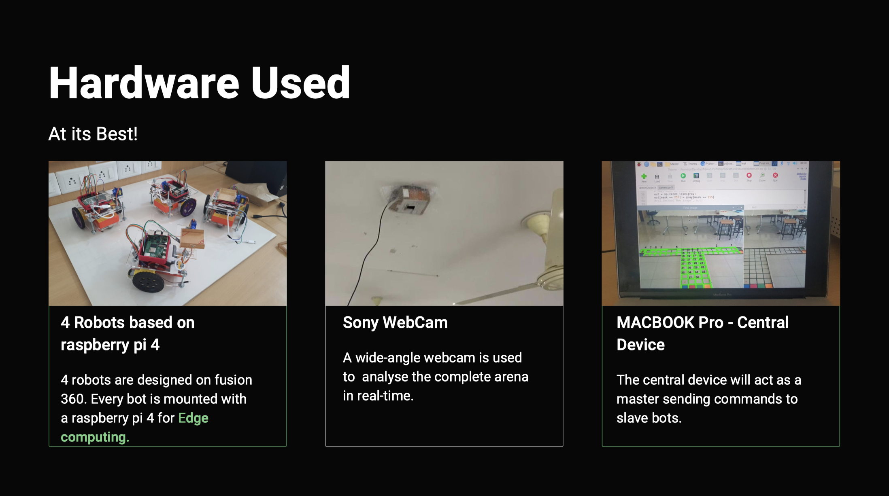

# Robot tracking via central monitoring system

--- 

## Auther: Rugved Chavan
Manipal University Jaipur

## Tech Stack:
OpenCV
Python3
BFS Algorithm
Socket TCP connection

## Installation Guide:
Run this command on terminal:
source venv/bin/activate
pip3 install -r /path/to/requirements.txt -f file:///path/to/archive/

Make changes in main.py
Change the path to where '/PathImg/grid2.png' is located
image = cv2.imread("/Users/rugvedchavan/PycharmProjects/FlipkartGridFinal/PathImg/grid2.png")

Change the path to where '/PathImg/grid5.png' is located
RealImage = cv2.imread("/Users/rugvedchavan/PycharmProjects/FlipkartGridFinal/PathImg/grid5.png")

# --ThankYou--